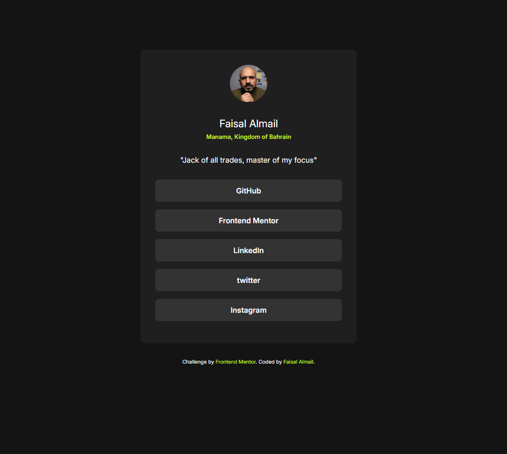
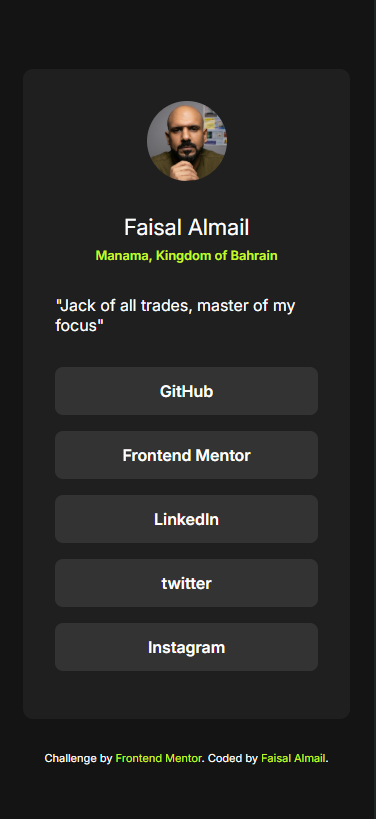
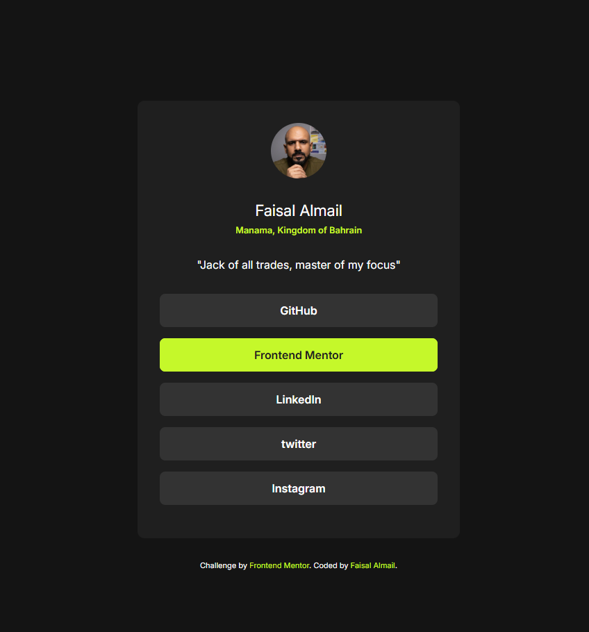

# Frontend Mentor - Social links profile solution

This is a solution to the [Social links profile challenge on Frontend Mentor](https://www.frontendmentor.io/challenges/social-links-profile-UG32l9m6dQ). Frontend Mentor challenges help you improve your coding skills by building realistic projects. 

## Table of contents

- [Overview](#overview)
  - [The challenge](#the-challenge)
  - [Screenshot](#screenshot)
  - [Links](#links)
- [My process](#my-process)
  - [Tools-used](#tools-used)
  - [What I learned](#what-i-learned)
- [Author](#author)

## Overview

### The challenge

Users should be able to:

- See hover and focus states for all interactive elements on the page

### Screenshot

### Links

- Solution URL: [https://github.com/faisalalmail/social-links-profile](https://github.com/faisalalmail/social-links-profile)
- Live Site URL: [https://social-links-profile-ten-vert.vercel.app/](https://social-links-profile-ten-vert.vercel.app/)

## My process
Being my third project, while I dont think its harder to code than the previous two, I think I did this pretty straight forward.

1. wrote the HTML code for the elements.
2. created the styles.
3. customization
### tools used

- VS code
- Git
- Github
- Vercel

### What I learned

Further understanding of responsiveness

## Author

My name is Faisal - A 35 year old guy from a small island in the middle of the world called Bahrain. I had the passion to code and practiced with html and PHP long ago. I stopped then, but the passion never died. and this could be my way to return.

- Instagram - [Faisal Almail](https://www.instagram.com/faisal.almail)
- Frontend Mentor - [@FaisalAlmail](https://www.frontendmentor.io/profile/faisalalmail)
